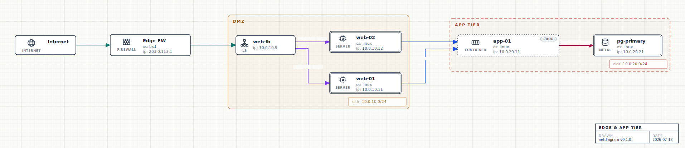

# netdiagram

Network architecture diagrams from YAML, rendered as blueprint-style SVG
schematics — a live editor and renderer in a **single self-contained HTML
file**. No server, no CDN, no build step; works offline.



## Quick start

**Just use it.** Download
**[`netdiagram.html`](https://github.com/keilr/netdiagram/releases/latest/download/netdiagram.html)**
from the [latest release](https://github.com/keilr/netdiagram/releases/latest)
and open it in any browser. That's the whole app: a YAML editor on the left, a
live diagram on the right. Nothing to install, no network needed, and nothing
leaves your machine.

> Building from source is only needed if you want to work on netdiagram itself —
> see [Development](#development).

## Write YAML, get a schematic

The diagram above is this spec:

```yaml
diagram:
  title: Edge & app tier
  direction: right

nodes:
  - {id: net,  label: Internet,   type: internet}
  - {id: fw,   label: Edge FW,     type: firewall, ip: 203.0.113.1, os: bsd}
  - {id: lb,   label: web-lb,      type: lb, ip: 10.0.10.9}
  - {id: web1, label: web-01,      type: server, ip: 10.0.10.11, os: linux}
  - {id: web2, label: web-02,      type: server, ip: 10.0.10.12, os: linux}
  - {id: app,  label: app-01,      type: container, ip: 10.0.20.11, os: linux, tags: [prod]}
  - {id: db,   label: pg-primary,  type: metal, icon: db, ip: 10.0.20.21, os: linux}

groups:
  - {id: dmz, label: DMZ,      class: zone,  cidr: 10.0.10.0/24, nodes: [lb, web1, web2]}
  - {id: lan, label: App tier, class: trust, cidr: 10.0.20.0/24, nodes: [app, db]}

connections:
  - {from: net,  to: fw,   label: "tcp/443 https",  protocol: tcp, port: 443}
  - {from: fw,   to: lb,   label: "tcp/443 https",  protocol: tcp, port: 443}
  - {from: lb,   to: web1, label: "tcp/8443 https", protocol: tcp, port: 8443}
  - {from: lb,   to: web2, label: "tcp/8443 https", protocol: tcp, port: 8443}
  - {from: web1, to: app,  label: "tcp/8080 api",   protocol: tcp, port: 8080}
  - {from: web2, to: app,  label: "tcp/8080 api",   protocol: tcp, port: 8080}
  - {from: app,  to: db,   label: "tcp/5432 pgsql", protocol: tcp, port: 5432}
```

Drawn device icons, tinted zone boundaries, color-coded connections and a
drafting title block — plus a firewall-rule table derived from the connections.
Load one of the bundled examples from the picker below the editor to see more.

## What's in the page

- **Live editor** — schema-aware autocomplete (keys, enum values like
  `type: f…` → `firewall`, and node/group ids for connection endpoints), inline
  validation, and hover docs; the diagram re-renders as you type.
- **Projects, saved in your browser** — the editor autosaves and restores on
  reload; **Save** (<kbd>Ctrl/Cmd-S</kbd>) named projects to switch between
  later. All in local storage — nothing leaves your machine. (If the browser
  blocks local storage, the project controls hide themselves and examples still
  work.)
- **Import / export** — import a `.yaml` file, download the source as **YAML**,
  download the diagram as **SVG**, or **Export PDF** (opens the print dialog; the
  diagram stays vector and page orientation follows its aspect).
- **Navigate** — zoom, pan and fit-to-view; the diagram auto-fits when loaded.

## Schema

`netdiagram-schema.json` is the JSON Schema for the format (it drives the
editor's completion and validation). The shape is `diagram`, `nodes`, `groups`,
`connections`:

### `diagram`
| key | values |
|---|---|
| `title` | shown in the drafting title block |
| `direction` | `down` (default) or `right` |
| *anything else* | any other scalar key (`author`, `revision`, `site`, …) is rendered as a row in the drafting title block |

### `nodes[]`
| key | notes |
|---|---|
| `id` | required, unique across nodes and groups |
| `label` | display name (defaults to id) |
| `type` | icon + caption: `router` `switch` `firewall` `waf` `db` `lb` `cloud` `internet` `user` `wifi` `siem` `storage` `vm` `container` `metal` `gpu` (aliases like `gw`, `docker`, `nas`, and `gpu-host` / `accelerator` / `cuda` work; the rack-server icon is `host` / `app` / `web`). Platform types `vm` / `container` / `metal` also set the border style: dashed / fine-dotted / double. `server`, `physical [server]`, `dedicated`, `baremetal` are aliases of `metal` |
| `icon` | explicit icon override — visual only, border styling follows `type` (e.g. `type: metal, icon: db`) |
| `ip` / `ips` | one or many; rendered one per line |
| `os` | free-form (`linux`, `windows`, `bsd`, …) |
| `tags` | informational labels — list (or single string), shown as neutral pills top-right (two per row). Tags never affect styling |
| *anything else* | unknown scalar keys render as `key: value` lines |

### `groups[]`
| key | notes |
|---|---|
| `id`, `label` | as for nodes |
| `class` | tint + border style. Generic: `zone` `vlan` `subnet` `cloud` `onprem` `trust` (trust = red dashed). Cisco ACI: `tenant` `vrf` `bd` `ap` `epg` `l3out` (l3out = orange dashed) |
| `style` | visual overrides: `color` (or `colour`) — one of `gray` `red` `orange` `yellow` `green` `teal` `cyan` `blue` `indigo` `purple` `pink`, overriding the class tint — and `border`: `solid` `dashed` `dotted` (CSS border-style names). E.g. `style: {color: blue, border: dashed}` |
| `cidr` | rendered as `cidr: <value>` in the info box in the group's lower-right corner |
| `tags` | informational labels — pills in the group's top-right corner, tinted in the group's own class/style color (list or single string) |
| `nodes` | member node ids (a node belongs to at most one group) |
| `groups` | nested groups, arbitrary depth |
| *anything else* | any other scalar key (`owner`, `site`, …) is rendered as `key: value` in the same info box |

**Compact fan-outs:** a group whose members have no connections of their own is
packed into a grid instead of one long row. So for hub-and-spoke topologies
(one switch feeding 20 hosts), connect the hub **to the group** rather than to
each member — the members pack compactly and the diagram stays near-square
instead of growing extremely wide.

### `connections[]`
| key | notes |
|---|---|
| `from`, `to` | node **or group** ids |
| `label` | shown at the edge midpoint (e.g. `"tcp/443 https"`) |
| `protocol` | `tcp`, `udp`, … — shown in the Connections table |
| `port` | destination port number or range — shown in the Connections table |
| `direction` | `forward` (default), `both`, `none`. In the Connections table a `both` connection is listed twice (once per direction) and a `none` (blocked) connection is left out |
| `comment` | free-form note (e.g. a rule justification) — shown in the Connections table, not drawn on the edge |

**Color rules:** a labeled connection gets a color from a categorical palette,
and **equal labels share the same color** (every `tcp/443 https` renders
identically); unlabeled connections use the default ink. The app's
**Connections tab** turns the list into a firewall-rule table — source and
destination (each with its address beneath it), protocol, port, label and any
comment — skipping pairs that sit in the same zone; a `both` connection appears
as two rows, one per direction.

## Use your own editor (CLI + VS Code)

You don't have to write YAML in the browser app — a CLI renders any spec file
straight to SVG (this is also how the image above is produced):

```bash
npm run render -- mynet.yaml                  # -> mynet.svg
npm run render -- mynet.yaml out.svg --watch  # re-render on every save
```

Opening this repo in VS Code gives the same schema-driven IntelliSense via
`.vscode/settings.json` and the recommended
[YAML extension](https://marketplace.visualstudio.com/items?itemName=redhat.vscode-yaml)
for `examples/*.yaml` and `*.netdiagram.yaml` files. Two build tasks feed the
current file to the CLI (one plain, one `--watch`); run the watch task and open
the generated SVG in a side-by-side tab for a live preview. For spec files
outside this repo, put a modeline on the first line instead:

```yaml
# yaml-language-server: $schema=/path/to/netdiagram-schema.json
```

## Development

Only needed to change netdiagram itself — the app ships as the prebuilt HTML.

```bash
npm install
npm run build   # -> dist/netdiagram.html (self-contained)
npm run lint    # eslint (flat config; runs first in CI)
npm test        # builds, then the assertion suite (pipeline, features, jsdom boot)
```

```
src/netdiagram.js    core: parseSpec -> buildElk -> renderSVG (browser + node)
src/app.js           browser wire-up (editor, render, projects, exports, zoom/pan)
src/editor.js        CodeMirror setup: schema-driven completion, lint, hover
src/template.html    page shell with injection placeholders
scripts/build.js     vendors js-yaml + elkjs, assembles dist/netdiagram.html
scripts/render.js    CLI: YAML -> SVG (--watch), for external editors
examples/            bundled examples (injected into the app's picker at build)
docs/example.yaml    source of the screenshot above
test/                npm test — pipeline, features, validation, jsdom boot
eslint.config.js     npm run lint — flat config
```

Layout is [ELK](https://eclipse.dev/elk/) (layered, orthogonal routing, real
nested-group support). See `CLAUDE.md` for architecture notes and the sharp
edges (ELK coordinate spaces, safe code inlining, etc.).

## License

MIT for project code. The built `dist/netdiagram.html` embeds
[js-yaml](https://github.com/nodeca/js-yaml) (MIT),
[elkjs](https://github.com/kieler/elkjs) (EPL-2.0),
[CodeMirror](https://codemirror.net/) (MIT) and
[codemirror-json-schema](https://github.com/acao/codemirror-json-schema) (MIT).
