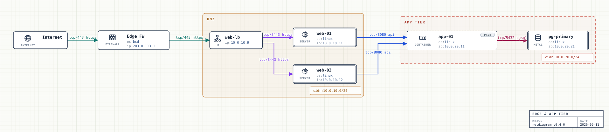

# netdiagram

Network architecture diagrams from YAML, rendered as blueprint-style SVG
schematics — a live editor and renderer in a **single self-contained HTML
file**. No server, no CDN, no build step; works offline.



## Quick start

**Just use it.** Download
**[`netdiagram.html`](https://github.com/keilr/netdiagram/releases/latest/download/netdiagram.html)**
from the [latest release](https://github.com/keilr/netdiagram/releases/latest)
and open it in any browser. That's the whole app: a YAML editor on the left, a
live diagram on the right. Nothing to install, no network needed, and nothing
leaves your machine.

Or use the hosted copy at **<https://keilr.github.io/netdiagram/>** — the same
file, published by CI on every release (share links from a local copy open it).

> Building from source is only needed if you want to work on netdiagram itself —
> see [Development](#development).

## Write YAML, get a schematic

The diagram above is this spec:

```yaml
diagram:
  title: Edge & app tier
  direction: right

nodes:
  - {id: net,  label: Internet,   type: internet}
  - {id: fw,   label: Edge FW,     type: firewall, ip: 203.0.113.1, os: bsd}
  - {id: lb,   label: web-lb,      type: lb, ip: 10.0.10.9}
  - {id: web1, label: web-01,      type: server, ip: 10.0.10.11, os: linux}
  - {id: web2, label: web-02,      type: server, ip: 10.0.10.12, os: linux}
  - {id: app,  label: app-01,      type: container, ip: 10.0.20.11, os: linux, tags: [prod]}
  - {id: db,   label: pg-primary,  type: metal, icon: db, ip: 10.0.20.21, os: linux}

groups:
  - {id: dmz, label: DMZ,      class: zone,  cidr: 10.0.10.0/24, nodes: [lb, web1, web2]}
  - {id: lan, label: App tier, class: trust, cidr: 10.0.20.0/24, nodes: [app, db]}

connections:
  - {from: net,  to: fw,   label: "tcp/443 https",  protocol: tcp, port: 443}
  - {from: fw,   to: lb,   label: "tcp/443 https",  protocol: tcp, port: 443}
  - {from: lb,   to: web1, label: "tcp/8443 https", protocol: tcp, port: 8443}
  - {from: lb,   to: web2, label: "tcp/8443 https", protocol: tcp, port: 8443}
  - {from: web1, to: app,  label: "tcp/8080 api",   protocol: tcp, port: 8080}
  - {from: web2, to: app,  label: "tcp/8080 api",   protocol: tcp, port: 8080}
  - {from: app,  to: db,   label: "tcp/5432 pgsql", protocol: tcp, port: 5432}
```

Drawn device icons, tinted zone boundaries, color-coded connections and a
drafting title block — plus a firewall-rule table derived from the connections.
Load one of the bundled examples from the picker below the editor to see more.

## What's in the page

- **Live editor** — schema-aware autocomplete (keys, enum values like
  `type: f…` → `firewall`, and node/group ids for connection endpoints), hover
  docs, and inline errors: an unknown endpoint, a duplicate id or a node listed
  in two groups is underlined where it is written. The diagram re-renders as you
  type.
- **Diagram ↔ YAML** — click a node, group or connection to jump to its YAML;
  wherever the cursor sits in the YAML, that item glows in the diagram. Click
  empty paper (or the selected item again) to clear the selection.
- **Projects, saved in your browser** — the editor autosaves and restores on
  reload; **Save** (<kbd>Ctrl/Cmd-S</kbd>) named projects to switch between
  later. All in local storage — nothing leaves your machine. (If the browser
  blocks local storage, the project controls hide themselves and examples still
  work.)
- **Import / export** — import netdiagram YAML, an **SVG downloaded from
  netdiagram** (every SVG carries its YAML source, so a diagram pasted into a
  wiki can be reopened and edited), or scaffold a spec from an **Ansible
  inventory**, **Terraform state** or a **NetBox export** (see
  [Import an inventory](#import-an-inventory)); files can also be dropped onto
  the page. Download the source as **YAML**, the diagram as **SVG**, or **Export PDF** (opens the print dialog;
  the diagram stays vector, A4 is preselected with orientation following the
  diagram's aspect, and the suggested file name is the diagram title,
  dash-concatenated — as for the SVG/YAML downloads).
- **Share link** — copies a link carrying the diagram (compressed) in the URL
  fragment, which browsers never send to a server. Opened from a local file, the
  link points at the hosted copy.
- **Compare** — pick a saved project (such as the last saved state of the one
  you are editing) or a YAML / netdiagram SVG file as the baseline: added,
  removed and changed nodes, groups and connections are marked **+ / − / ~** in
  the diagram, and the Connections table marks the rule changes — a firewall
  change review in one view.
- **Tag filter** — when the document uses `tags`, chips above the diagram show
  only what carries the selected tags (a tagged group keeps its whole contents);
  the title block notes the filter.
- **Navigate** — zoom, pan and fit-to-view; the diagram auto-fits when loaded.

## Schema

`netdiagram-schema.json` is the JSON Schema for the format (it drives the
editor's completion and validation). The shape is `diagram`, `nodes`, `groups`,
`connections`:

### `diagram`
| key | values |
|---|---|
| `title` | shown in the drafting title block |
| `direction` | `down` (default) or `right` |
| `theme` | `paper` (default) or `blueprint` — white linework on cyanotype blue |
| `date` | shown in the title block's DATE cell instead of today; pin it to keep rendered SVGs reproducible |
| *anything else* | any other scalar key (`author`, `revision`, `site`, …) is rendered as a row in the drafting title block |

### `nodes[]`
| key | notes |
|---|---|
| `id` | required, unique across nodes and groups |
| `label` | display name (defaults to id) |
| `type` | icon + caption: `router` `switch` `firewall` `waf` `db` `lb` `cloud` `internet` `user` `wifi` `siem` `storage` `vm` `container` `metal` `gpu` (aliases like `gw`, `docker`, `nas`, and `gpu-host` / `accelerator` / `cuda` work; the rack-server icon is `host` / `app` / `web`). Platform types `vm` / `container` / `metal` also set the border style: dashed / fine-dotted / double. `server`, `physical [server]`, `dedicated`, `baremetal` are aliases of `metal`, and so is `hypervisor` (`esx`, `esxi`, `kvm`, `proxmox`). Kubernetes vocabulary: `ingress` / `service` draw the load-balancer icon, `egress` / `egress-ip` the gateway, `etcd` the database, `pod` the container, `control-plane` / `master` the rack server |
| `icon` | explicit icon override — visual only, border styling follows `type` (e.g. `type: metal, icon: db`) |
| `ip` / `ips` | one or many; rendered one per line |
| `os` | free-form (`linux`, `windows`, `bsd`, …) |
| `tags` | informational labels — list (or single string), shown as neutral pills top-right (two per row). Tags never affect styling |
| `rank` | placement hint among siblings: lower rank lays out earlier in the flow (higher up in a `down` layout). Unranked siblings sit at rank 0 — use negative ranks to place before them, positive to place after |
| `nodes` | **child nodes drawn inside this one** — see [Nodes inside nodes](#nodes-inside-nodes) |
| *anything else* | unknown scalar keys render as `key: value` lines |

#### Nodes inside nodes

A node can carry its own `nodes:` list — child nodes drawn **inside its box**.
That is what "this VM runs on that hypervisor" actually means, so it needs no
association edge:

```yaml
nodes:
  - id: esx1
    label: esx-01
    type: hypervisor
    ip: 10.40.0.11
    nodes:
      - {id: web1, label: web-01, type: vm, ip: 10.40.10.11}
      - {id: web2, label: web-02, type: vm, ip: 10.40.10.12}
```

Children are full node objects and nest to any depth (a container inside a VM
inside a host — see `examples/virt-hosts.yaml`). The host's own glyph, label and
attribute lines sit at the top of the box and the children lay out underneath.

Ids stay unique across **every** level, so a connection can address a child
directly (`{from: fw, to: web1}`) and the edge routes into the box. A node that
sits inside another cannot also be listed in a group's `nodes:` — it is already
somewhere. In the Connections table a node's host is its zone, so guests on the
same host need no rule between them, exactly as members of one group don't.

**Groups or containment?** A group is a boundary *drawn around* nodes — a VLAN,
a zone, a tenant. Containment is for when the container is itself a device that
runs the things inside it.

### `groups[]`
| key | notes |
|---|---|
| `id`, `label` | as for nodes |
| `class` | tint + border style. Generic: `zone` `vlan` `subnet` `cloud` `onprem` `trust` (trust = red dashed). Cisco ACI: `tenant` `vrf` `bd` `ap` `epg` `l3out` (l3out = orange dashed). Kubernetes: `cluster` / `k8s` (blue), `namespace` / `ns` (green), `nodepool` (grey) |
| `style` | visual overrides: `color` (or `colour`) — one of `gray` `red` `orange` `yellow` `green` `teal` `cyan` `blue` `indigo` `purple` `pink`, overriding the class tint — and `border`: `solid` `dashed` `dotted` (CSS border-style names). E.g. `style: {color: blue, border: dashed}` |
| `cidr` | rendered as `cidr: <value>` in the info box in the group's lower-right corner |
| `tags` | informational labels — pills in the group's top-right corner, tinted in the group's own class/style color (list or single string) |
| `rank` | placement hint, as for nodes — e.g. `rank: -1` moves a group above the unranked row, `rank: 1` below it |
| `nodes` | member node ids (a node belongs to at most one group) |
| `groups` | nested groups, arbitrary depth |
| *anything else* | any other scalar key (`owner`, `site`, …) is rendered as `key: value` in the same info box |

**Compact fan-outs:** a group whose members have no connections of their own is
packed into a grid instead of one long row. So for hub-and-spoke topologies
(one switch feeding 20 hosts), connect the hub **to the group** rather than to
each member — the members pack compactly and the diagram stays near-square
instead of growing extremely wide.

**Controlling placement:** by default every neighbor of a hub lands in the row
after it, which makes wide diagrams. Use `rank` to spread them around the hub
instead — `rank: -1` groups lay out above it, `rank: 1` below (see
`examples/ansible-inventory.yaml`). Siblings with the same rank are ordered
**left to right by their YAML order**, so reordering the file reorders the row.

### `connections[]`
| key | notes |
|---|---|
| `from`, `to` | node **or group** ids |
| `label` | shown at the edge midpoint (e.g. `"tcp/443 https"`) |
| `protocol` | `tcp`, `udp`, … — shown in the Connections table |
| `port` | destination port number or range — shown in the Connections table |
| `direction` | `forward` (default), `both`, `none`. In the Connections table a `both` connection is listed twice (once per direction) and a `none` (blocked) connection is left out |
| `comment` | free-form note (e.g. a rule justification) — shown in the Connections table, not drawn on the edge |

**Crossings:** connection points on a node are automatically ordered toward
their targets (a second layout pass), so edges fan out of a hub without
crossing each other, and a connection to a group placed *before* the hub
(negative `rank`) attaches to the group's near side instead of looping around
it. Where connections must still cross, the later one hops over the earlier
with a small arc — the classic schematic convention for "these wires don't
connect".

**Color rules:** a labeled connection gets a color from a categorical palette,
and **equal labels share the same color** (every `tcp/443 https` renders
identically); unlabeled connections use the default ink. The app's
**Connections tab** turns the list into a firewall-rule table — source and
destination (each with its address beneath it), protocol, port, label and any
comment — skipping pairs that sit in the same zone; a `both` connection appears
as two rows, one per direction.

### `views[]`

One document, several pictures of it. A **view** narrows the diagram and may
override render options, so an overview, a per-zone detail and one
application's flow all stay derived from the same model instead of drifting
apart in copied files:

```yaml
views:
  - {id: edge, title: "HQ — edge",      focus: fw1, depth: 1}
  - {id: pci,  title: "HQ — PCI scope", tags: [pci]}
  - {id: mgmt, title: "Management",     focus: oob, depth: 1, direction: right}
```

| key | notes |
|---|---|
| `id` | required; selects the view (`--view edge`, or the app's **View** picker) |
| `title` | title-block text for this view, overriding `diagram.title` |
| `tags` | show only what carries one of these tags — the same narrowing as the tag filter |
| `focus` | a node or group id: keep it and everything inside it, plus whatever is within `depth` connection hops |
| `depth` | how many hops from `focus` to include (default 1; `0` = focus and its contents only) |
| `direction`, `theme` | per-view overrides of the `diagram` options |

Narrowing runs `tags` first, then `focus`. Hops are counted over the
connections as written, so a connection that ends at a *group* is one hop like
any other — which is what makes `focus: <a group>` with `depth: 1` a useful
"this zone and what touches it" view.

Two things follow from that. A `focus` that is not itself a connection endpoint
has nothing to expand, so `depth` does nothing — point it at a node or group
that connections actually reach. And a kept guest always brings the host that
draws it: the host survives as a shell holding only the guests that were kept,
so `focus: <a VM>` shows that VM inside its hypervisor.

```bash
npm run render -- hq.yaml --list-views      # what this spec defines
npm run render -- hq.yaml out.svg --view edge
```

In the app a **View** picker appears in the diagram tab bar whenever the
document defines any; the title block records which view is drawn.

## Use your own editor (CLI + VS Code)

You don't have to write YAML in the browser app — a CLI renders any spec file
straight to SVG (this is also how the image above is produced):

```bash
npm run render -- mynet.yaml                       # -> mynet.svg
npm run render -- mynet.yaml out.svg --watch       # re-render on every save
npm run render -- mynet.yaml --theme blueprint     # cyanotype colors
npm run render -- mynet.yaml --tags prod,pci       # only what carries these tags
npm run render -- mynet.yaml --view edge           # one named view (see views: above)
npm run render -- mynet.yaml --list-views          # what views this spec defines
npm run render -- mynet.yaml pr.svg --compare main.yaml --csv rules.csv
                                                   # change review: marked diagram + rule CSV
npm run render -- old.svg --extract > old.yaml     # the YAML back out of an exported SVG
```

The title-block date comes from `--date`, else `diagram.date`, else
`$SOURCE_DATE_EPOCH`, else today — so renders in CI are byte-reproducible.

Opening this repo in VS Code gives the same schema-driven IntelliSense via
`.vscode/settings.json` and the recommended
[YAML extension](https://marketplace.visualstudio.com/items?itemName=redhat.vscode-yaml)
for `examples/*.yaml` and `*.netdiagram.yaml` files. Two build tasks feed the
current file to the CLI (one plain, one `--watch`); run the watch task and open
the generated SVG in a side-by-side tab for a live preview. For spec files
outside this repo, put a modeline on the first line instead:

```yaml
# yaml-language-server: $schema=/path/to/netdiagram-schema.json
```

## Import an inventory

Start from what you already have. Importers build nodes and groups; inventories
don't describe traffic, so `connections:` are left to you.

```bash
npm run import -- inventory.ini -o net.yaml         # Ansible INI or YAML inventory
ansible-inventory -i inventory --list | npm run import -- - -o net.yaml
terraform show -json | npm run import -- - --from terraform -o net.yaml
npm run import -- devices.json -o net.yaml          # NetBox devices / virtual-machines API JSON
```

- **Ansible** — `children` nest groups; a host lives in its most specific group
  and its other groups become tags; `ansible_host` becomes the address. No other
  variables are read — they often hold credentials.
- **Terraform** — VPCs / VNets / networks and their subnets become nested groups
  with CIDRs; instances, databases, load balancers and gateways (AWS, Azure, GCP;
  instances also for OpenStack, Proxmox, vSphere, libvirt, Hetzner, DigitalOcean)
  land in their subnet.
- **NetBox** — devices group by site, then rack; VMs by site, then cluster. The
  role picks the icon, the primary IP the address, the platform the `os`.

The format is detected (`--from ansible|terraform|netbox` forces one). The page's
**Import** button and drag & drop use the same importers.

## Check it in CI

`npm run check` reads the spec as a **model**, not as text, and exits non-zero
when something is wrong — so a diagram can gate a pull request:

```bash
npm run check -- net.yaml                       # architecture lint
npm run check -- net.yaml --strict              # warnings fail too
npm run check -- net.yaml --json                # machine-readable findings
terraform show -json | npm run check -- net.yaml --against - --from terraform
```

Validation asks whether the document is well *formed*; this asks whether the
network it describes is *coherent*:

| rule | severity | what it catches |
|---|---|---|
| `ip-outside-cidr` | error | an address that falls in **no** declared subnet. A second NIC on another declared subnet is legitimate dual-homing and is not flagged |
| `duplicate-ip` | error | the same address on two nodes |
| `cidr-overlap` | error | two unrelated groups claiming overlapping ranges (a subnet nested in its supernet is fine) |
| `blocked-contradiction` | error | a pair that is both `direction: none` and allowed elsewhere |
| `self-connection` | error | a connection from a node to itself |
| `unknown-type` / `unknown-icon` | warning | a token that draws no glyph — a typo the renderer would swallow |
| `unknown-class` | warning | a group class that silently falls back to default styling |
| `isolated` | warning | a node no connection reaches, directly or through its group |

All bundled examples are clean, and the test suite asserts they stay that way.

**Drift.** `--against` imports a live inventory (Ansible, Terraform, NetBox) and
compares it with the spec, so CI can fail when the picture stops matching
reality: a host in the inventory that the diagram never got (`missing`), a node
the inventory no longer has (`extra`), or one whose address changed
(`address`). Ids differ between the two — importers slugify hostnames — so
nodes are matched on id, then on any shared IP, then on label. Group membership
is deliberately not compared: group identity isn't stable across importers, so
"moved" would be guesswork.

## Development

Only needed to change netdiagram itself — the app ships as the prebuilt HTML.

```bash
npm install
npm run build   # -> dist/netdiagram.html (self-contained)
npm run lint    # eslint (flat config; runs first in CI)
npm test        # builds, then the assertion suite (pipeline, features, importers, CLI, golden SVGs, jsdom)
npm run test:golden   # re-render test/golden/*.svg after an intended visual change — review the diff
```

```
src/netdiagram.js    core: parseSpec -> buildElk -> renderSVG (browser + node)
src/app.js           browser wire-up (editor, render, projects, exports, zoom/pan)
src/editor.js        CodeMirror setup: schema-driven completion, lint, hover
src/importers.js     Ansible / Terraform / NetBox -> netdiagram YAML (browser + node)
src/template.html    page shell with injection placeholders
scripts/build.js     vendors js-yaml + elkjs, assembles dist/netdiagram.html
scripts/render.js    CLI: YAML -> SVG (--watch --theme --tags --view --compare --csv --extract)
scripts/import.js    CLI: inventory -> YAML scaffold
scripts/check.js     CLI: architecture lint + drift vs a live inventory (CI gate)
examples/            bundled examples (injected into the app's picker at build)
docs/example.yaml    source of the screenshot above
test/                npm test — pipeline, features, validation, importers, CLI, jsdom
test/golden/         reference SVGs for every example (npm run test:golden)
eslint.config.js     npm run lint — flat config
```

Layout is [ELK](https://eclipse.dev/elk/) (layered, orthogonal routing, real
nested-group support). See `CLAUDE.md` for architecture notes and the sharp
edges (ELK coordinate spaces, safe code inlining, etc.).

## License

MIT for project code. The built `dist/netdiagram.html` embeds
[js-yaml](https://github.com/nodeca/js-yaml) (MIT),
[elkjs](https://github.com/kieler/elkjs) (EPL-2.0),
[CodeMirror](https://codemirror.net/) (MIT) and
[codemirror-json-schema](https://github.com/acao/codemirror-json-schema) (MIT).
